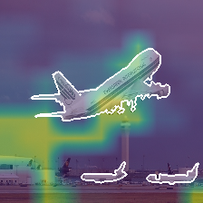
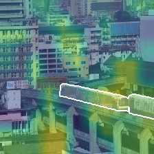

# Where Not to Learn: Prior-Aligned Training with Subset-based Attribution Constraints for Reliable Decision-Making

Official PyTorch implementation of [*Where Not to Learn: Prior-Aligned Training with Subset-based Attribution Constraints for Reliable Decision-Making*](https://arxiv.org/abs/2602.07008).

[](https://arxiv.org/abs/2602.07008)
[](LICENSE)

This repository studies visual attribution methods whose explanations align with human priors. It includes training, evaluation, Pointing Game, and visualization entrypoints for Saliency-Bench and ImageNet-S919.

## Setup

```bash
conda env create -f environment.yml
conda activate prior_alignment
```

The provided environment uses PyTorch 2.5.1 with CUDA 12.1 and pins the remaining training, attribution, and visualization dependencies. It installs `opencv-contrib-python-headless`, which provides the `cv2.ximgproc` SLIC/SLICO implementation used for region construction.

## Datasets

The supplied lists use paths relative to the repository root.

| Dataset | List directory | Expected root directory |
| --- | --- | --- |
| Saliency-Bench Object-XAI (PASCAL) | `data_list/saliency-bench/` | `Saliency-Bench/pascal/` |
| ImageNet-S919 | `data_list/imagenet-s919/` | `ImageNetS919/` |

`Saliency-Bench/pascal/` contains `image/<class>/` and `attention_mask/<class>/`; each mask is a NumPy `.npy` file aligned with its image. The dataset files are intentionally excluded from version control.

ImageNet-S919 provides public segmentation annotations, but its train and validation images are derived from ImageNet-1K. Obtain an authorized local ImageNet-1K copy first, then follow the official ImageNet-S preparation workflow to populate `ImageNetS919/train-semi/` and `ImageNetS919/validation/`. The expected mask locations are `train-semi-segmentation/` and `validation-segmentation/`.

## Running experiments

### Unified prior-alignment training

`train_prior_alignment.py` provides one entrypoint for both datasets and all three model families:

```bash
python train_prior_alignment.py \
  --dataset saliency-bench \
  --model clip \
  --loss-variant adaptive_log \
  --adaptive-beta 2 \
  --seed 0
```

Supported choices are:

- Dataset: `saliency-bench` or `imagenet-s919`.
- Model: `clip`, `vit`, or `resnet`.
- Loss: `paper` or `adaptive_log`.

The `paper` baseline uses the reviewer-motivated zero-margin redundancy loss

```text
ReLU(F(prefix_after) - F(prefix_before)).
```

The adaptive loss penalizes only the off-prior gain above the best current prior-consistent gain. Its detached reference scale combines that human-consistent gain with full-image prediction uncertainty. Use `--adaptive-beta 1`, `2`, or `4` for the planned loss-shape ablation. Run `python train_prior_alignment.py --help` for alignment intervals, LIMA length, confidence thresholds, train scope, AMP, resume, and loss-weight options.

For multi-GPU training:

```bash
torchrun --standalone --nproc-per-node=2 train_prior_alignment.py \
  --dataset saliency-bench --model vit \
  --loss-variant adaptive_log --adaptive-beta 2 --seed 0
```

Checkpoints contain the unwrapped model state dict under `model`, so the existing explanation and Pointing Game entrypoints can load them directly. Each epoch is divided into four evaluation segments by default. A segment that produced only CE updates and no alignment examples is not evaluated. After alignment starts, evaluation runs at the next quarter boundary; training stops early if Top-1 falls at least `0.05` (five percentage points) below its historical best. These defaults can be changed with `--evals-per-epoch`, `--eval-without-alignment`, `--early-stop-acc-drop`, and `--disable-accuracy-drop-stop`.

Each performed evaluation appends to `metrics.jsonl`, recording its epoch fraction and Top-1/Top-2 together with bad gain, best human gain, excess, reference scale, adaptive weight, and the satisfied-region fraction.

### Three-seed experiment matrix

The experiment launcher runs `paper` and `adaptive_log` with beta `1/2/4` using seeds `0/1/2`. Completed runs are skipped and interrupted epoch-level runs resume from `last.pt`:

```bash
# Inspect the commands first.
DATASETS=saliency-bench MODELS=clip DRY_RUN=1 \
  ./run_prior_alignment_experiments.sh

# Run the Saliency-Bench CLIP comparison (4 losses x 3 seeds).
DATASETS=saliency-bench MODELS=clip \
  ./run_prior_alignment_experiments.sh
```

Without overrides, the launcher uses all three models and also includes ImageNet-S919 when all listed files are available. Space-separated `DATASETS`, `MODELS`, `SEEDS`, and `BETAS` environment variables restrict the matrix. Common overrides include `EPOCHS`, `BATCH_SIZE`, `NUM_WORKERS`, `ALIGNMENT_INTERVAL`, `EVALS_PER_EPOCH`, `EARLY_STOP_ACC_DROP`, `LIMA_LENGTH`, and `CUDA_VISIBLE_DEVICES`.

Results are written under `seed_results/<dataset>/<model>/<method>/seed_<n>/`. Aggregated tables are saved as `seed_results/prior_alignment_summary.csv` and `seed_results/prior_alignment_summary.md`.

The standard comparison baselines can be launched separately:

```bash
./run_all_baselines_3seeds.sh
```

Their summaries use the epoch with the best validation Top-1 score and are written to `seed_results/summary.csv` and `seed_results/summary.md`.

### Legacy entrypoints

The original dataset-specific implementations remain available:

```bash
# Saliency-Bench
python vision_task_saliency_bench/human_prior_alignment_v2_CLIP.py

# ImageNet-S919
python vision_task_imagenet-s/human_prior_alignment_v3_resnet.py
```

Each script exposes `--train_txt` and `--test_txt`, defaulting to the corresponding lists under `data_list/`. Use `--help` on a specific entrypoint to inspect model, batch size, checkpoint, and distributed-training options.

### Tests

```bash
python -m unittest discover -s tests -p 'test_*.py' -v

PYTHONPATH=. python -m torch.distributed.run --standalone \
  --nproc_per_node=2 tests/ddp_alignment_smoke.py
```

For attribution evaluation, use the Pointing Game scripts:

```bash
python point_game_saliency_bench.py
python point_game_imagenets.py
```

## Results

| Model | Human prior | Method | Top-1 accuracy | Top-2 accuracy | Point Game@0.2 |
| --- | --- | --- | ---: | ---: | ---: |
| CLIP | Mask | Zero-shot | 0.6574 | 0.7847 | 0.5440 |
| CLIP | Mask | Fine-tuning | 0.6076 | 0.8495 | 0.5231 |
| CLIP | Mask | Ours v2 | 0.6551 | 0.8264 | 0.5648 |
| ViT-Base | Mask | Fine-tuning | 0.5440 | 0.7558 | 0.4363 |
| ViT-Base | Mask | Ours v2 | 0.5359 | 0.7512 | 0.4838 |
| ViT-Base | Mask | Ours v3 | 0.5787 | 0.7650 | 0.4988 |
| ResNet-101 | Mask | Fine-tuning | 0.3866 | 0.5880 | 0.4838 |
| ResNet-101 | Mask | Ours v3 | 0.4965 | 0.7014 | 0.5231 |

## Visualizations

| Model | Fine-tuning | Human alignment |
| --- | --- | --- |
| ViT |  |  |
| ViT |  |  |

## License

The source code is released under the [MIT License](LICENSE). Dataset licenses remain with their respective providers.

## Citation

If you use this code, please cite:

```bibtex
@article{chen2026where,
  title={Where Not to Learn: Prior-Aligned Training with Subset-based Attribution Constraints for Reliable Decision-Making},
  author={Chen, Ruoyu and Sun, Shangquan and Guo, Xiaoqing and Zhang, Sanyi and Liu, Kangwei and Liu, Shiming and Wang, Zhangcheng and Zhang, Qunli and Zhang, Hua and Cao, Xiaochun},
  journal={arXiv preprint arXiv:2602.07008},
  year={2026}
}
```
